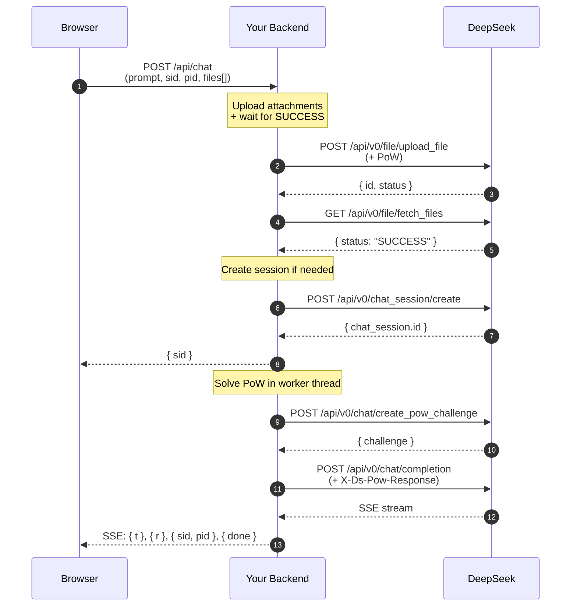
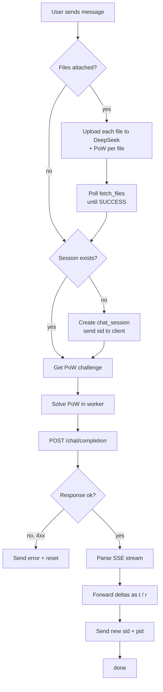

# DeepSeek Wrapper

A minimal, self-hosted chat interface for DeepSeek. The backend wraps DeepSeek's web API — it handles authentication, chat sessions, proof-of-work, file/image uploads, and streaming responses. The frontend is a single HTML file with no external dependencies.

**Repository:** https://github.com/kushalkumarj2006/deepseek-wrapper.git

## What it does

- **One chat per browser** — sessions live in `localStorage`; the backend is stateless.
- **No login** — credentials sit in server env vars, never exposed to the client.
- **Streaming replies** — SSE with batched deltas to keep bandwidth low.
- **File and image uploads** — routed through DeepSeek's vision pipeline.
- **Think + Search toggles** — both map directly to DeepSeek's completion flags.
- **PoW solved server-side** — the original DeepSeek worker runs in a Node worker thread with its WASM served from disk.

## Layout

```
deespeek/
├── .gitignore
├── README.md
├── index.html              ← frontend, host anywhere (GitHub Pages, Netlify, …)
└── render/
    ├── package.json
    ├── server.js
    ├── pow.js              ← DeepSeek's worker bundle, renamed
    ├── chunk8138.js        ← DeepSeek's worker chunk, renamed
    ├── sha3.wasm           ← DeepSeek's WASM, renamed
    └── .env.example
```

## Requirements

- **Node.js 18.17+** — the server uses global `fetch`, `FormData`, `Blob`, and `Response`.
- **DeepSeek credentials** — a `userToken` and an `smidV2` cookie from a logged-in `chat.deepseek.com` session.

## Setup

### 1. Get your DeepSeek credentials

Open `chat.deepseek.com` in a browser, log in, then open DevTools → Console and run:

```js
JSON.stringify({
  userToken: JSON.parse(localStorage.getItem('userToken') || '{}').value,
  smidV2: document.cookie.split('; ').find(r => r.startsWith('smidV2='))?.split('=')[1]
})
```

Copy the resulting JSON.

### 2. Download the PoW assets

From a network capture of `chat.deepseek.com`, grab these three files and place them in `render/`:

| Source filename | Save as |
|---|---|
| `37627.ebf6d8f55d.js` (or whichever the current build serves) | `pow.js` |
| `8138.63461459c3.js` | `chunk8138.js` |
| `sha3_wasm_bg.7b9ca65ddd.wasm` | `sha3.wasm` |

The exact hashes change when DeepSeek ships a new web build. If PoW starts failing, the server log will show `importScripts` with the new URL — download that file and replace `chunk8138.js`.

### 3. Configure

Copy `.env.example` to `.env` inside `render/`:

```env
DS_USER_TOKEN=paste_your_userToken_here
DS_SMID_V2=paste_your_smidV2_cookie_here
PORT=3000
DEBUG=0
```

Set `DEBUG=1` for verbose logs (DeepSeek request/response bodies, PoW challenges, SSE blocks).

### 4. Run locally

```bash
cd render
npm install
npm start
```

Server listens on `http://localhost:3000`. Health check: `GET /health` → `ok`.

### 5. Open the frontend

The frontend must be served over HTTP — `file://` origins are blocked by CORS.

Easiest way: install the **Live Server** VS Code extension, right-click `index.html`, **Open with Live Server**. It serves at `http://127.0.0.1:5500/index.html`.

`index.html` auto-detects `localhost` / `127.0.0.1` and points `API_BASE` at `http://localhost:3000`. For production, change that constant to your deployed backend URL.

## Deploying

### Backend → Render

1. Push the repo to GitHub.
2. New **Web Service** → connect `kushalkumarj2006/deepseek-wrapper`.
3. **Root directory:** `render`
4. **Build command:** `npm install`
5. **Start command:** `npm start`
6. **Environment variables:**
   - `DS_USER_TOKEN`
   - `DS_SMID_V2`
   - `DEBUG` = `0`

   (Do **not** commit `.env` — Render reads these from the dashboard.)

Free tier is enough. The PoW worker runs one task at a time in a FIFO queue, so a 0.1-CPU instance handles several concurrent users fine.

### Frontend → GitHub Pages

1. Push `index.html` to the repo.
2. Settings → Pages → deploy from branch / folder.
3. Edit the `API_BASE` constant in `index.html`:

```js
var API_BASE = /^(localhost|127\.0\.0\.1|\[::1\])$/.test(location.hostname)
  ? 'http://localhost:3000'
  : 'https://your-service.onrender.com';   // ← change this
```

CORS is `*` on the backend, so any static host works.

## How it works



- **`session_id`** and **`parent_message_id`** are owned by the browser, sent back with each request. The server keeps no state between calls.
- **PoW** is required for both `upload_file` and `completion`. Solved in a single `worker_threads` worker with a FIFO queue.
- **SSE fragments** — DeepSeek emits `RESPONSE`, `SEARCH`, and `THINK` fragment types. The wrapper forwards `THINK` as `{t: "..."}` (rendered as italic thinking text) and everything else as `{r: "..."}`.
- **Session reset** — on a 4xx from DeepSeek (except 429), the server emits `{reset:1}`. The frontend clears `sid`/`pid` and the next message starts a fresh conversation.

### Request lifecycle



## API

### `POST /api/chat`

Multipart form:

| Field | Type | Notes |
|---|---|---|
| `prompt` | string | Message text. May be empty if `files` are attached. |
| `thinking` | `"0"` / `"1"` | Enable chain-of-thought. |
| `search` | `"0"` / `"1"` | Enable web search. |
| `session_id` | string | Omitted on the first message. |
| `parent_message_id` | number | Omitted on the first message. |
| `files` | file(s) | Up to 6, 25 MB each. |

Response: `text/event-stream`. Each line is `data: {json}`:

```jsonc
{ "sid": "..." }        // session created (first message only)
{ "s": "uploading" }    // status
{ "s": "thinking" }     // status
{ "t": "..." }          // thinking delta
{ "r": "..." }          // response delta (also used for search answers)
{ "title": "..." }      // DeepSeek's auto-generated chat title
{ "sid": "...", "pid": 42 }  // session id + latest parent message id
{ "done": 1 }           // stream complete
{ "e": "...", "reset": 1 }   // error; reset means drop sid/pid
```

### `GET /health`

Returns `ok` when the process is up.

## Files

| File | Purpose |
|---|---|
| `render/server.js` | Express server — CORS, uploads, PoW queue, DeepSeek proxy, SSE parser. |
| `render/pow.js` | DeepSeek's worker bundle. Loaded into a `vm` sandbox that mimics a Web Worker. |
| `render/chunk8138.js` | The chunk `pow.js` loads via `importScripts`. Contains the actual `onmessage` handler. |
| `render/sha3.wasm` | SHA3 WASM used by the PoW. Served from disk, never over HTTP. |
| `index.html` | Chat UI. No build step, no dependencies. |

## Environment variables

| Name | Required | Default | Notes |
|---|---|---|---|
| `DS_USER_TOKEN` | yes | — | `userToken` from `chat.deepseek.com`. |
| `DS_SMID_V2` | yes | — | `smidV2` cookie value. |
| `PORT` | no | `3000` | Server port. |
| `DEBUG` | no | `0` | `1` for verbose logs. |

## Troubleshooting

**`Set DS_USER_TOKEN and DS_SMID_V2 in .env`** — the `.env` file is missing, or you're running from the wrong directory. It must sit next to `server.js`.

**`pow init: ... importScripts not supported`** — DeepSeek rotated the chunk hash. Download the new `8138.*.js` from `fe-static.deepseek.com` and save it as `chunk8138.js`.

**Empty replies** — check the server log for `deltasSent`. If it's above 0 but the frontend is blank, the SSE `emit` path is being skipped. The log also shows the raw fragment type; DeepSeek occasionally adds new ones.

**`Completion 4xx`** — your credentials expired. Re-run the extraction script and update `.env`. The frontend will auto-reset its session on the next message.

**CORS error in the browser** — you're opening `index.html` from `file://`. Use Live Server or any static HTTP host.

## Notes

- **No persistence.** Everything the server needs to talk to DeepSeek comes with the request. Restarting the server is invisible to clients.
- **One DeepSeek session per browser.** Two browsers, two users, two devices → independent conversations. Clearing `localStorage` starts a new one.
- **The credentials belong to one DeepSeek account.** If you deploy this publicly, all visitors share that account. Add auth in front of `/api/chat` if that's not what you want.
- **DeepSeek's web API is unofficial.** The endpoints, headers, and SSE format are reverse-engineered and can change without warning.

## License

MIT
